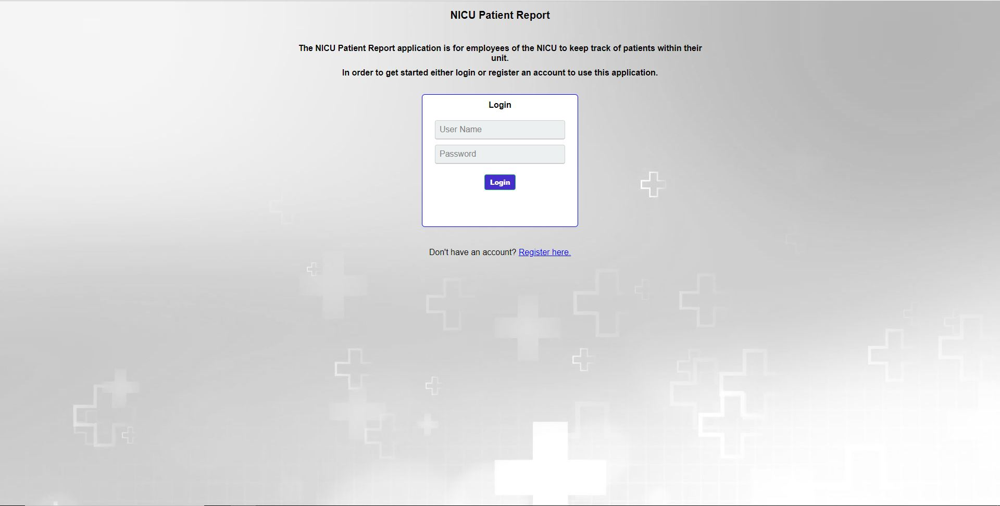
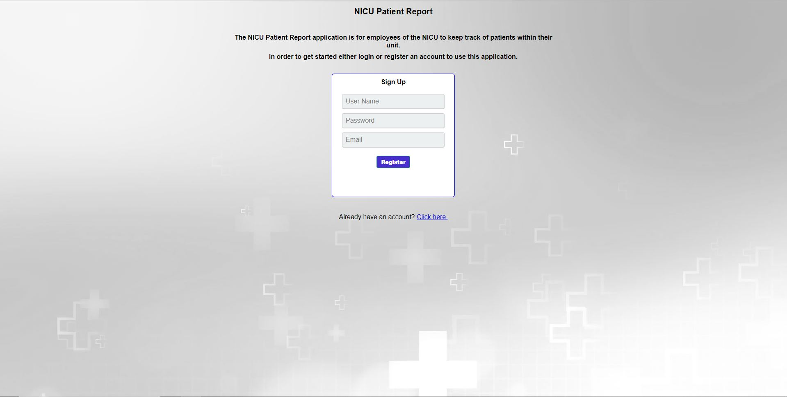
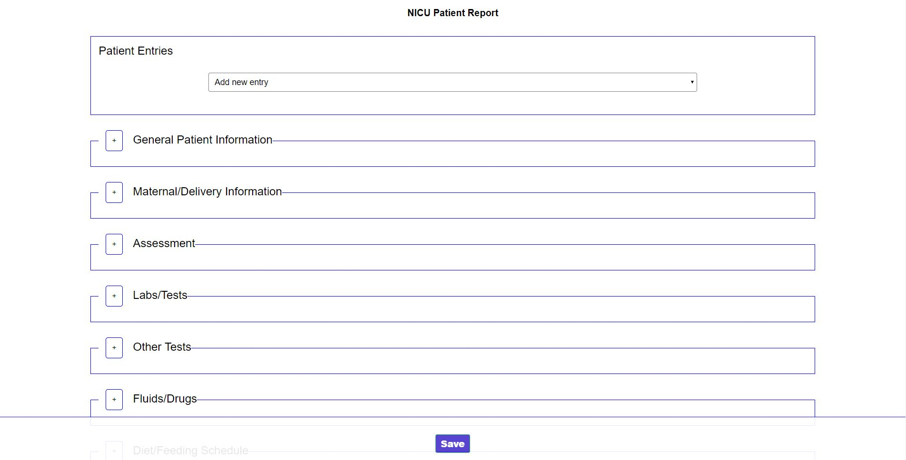
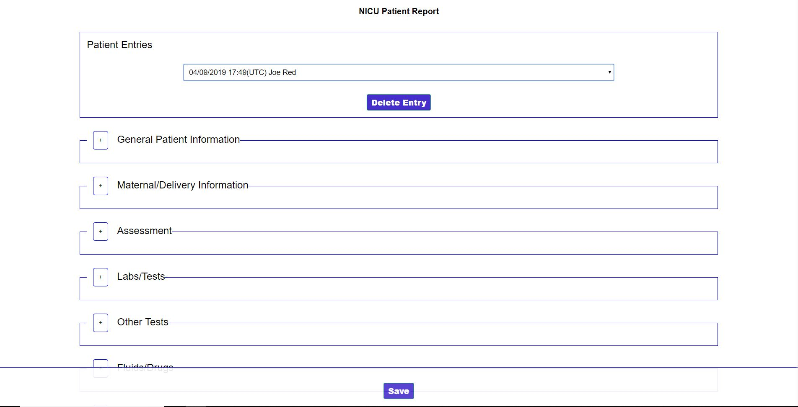
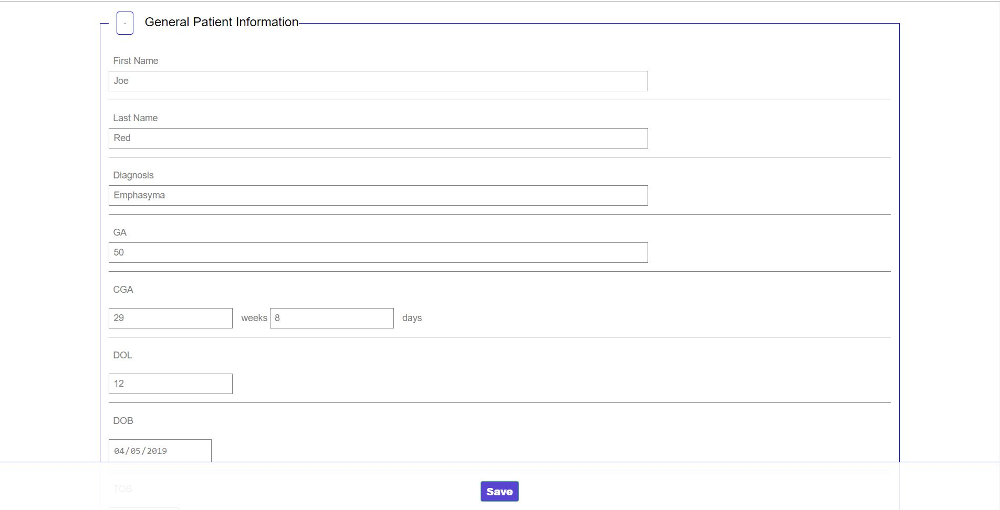
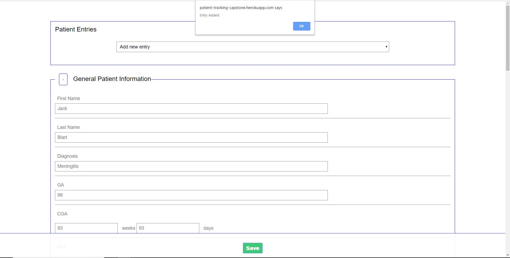
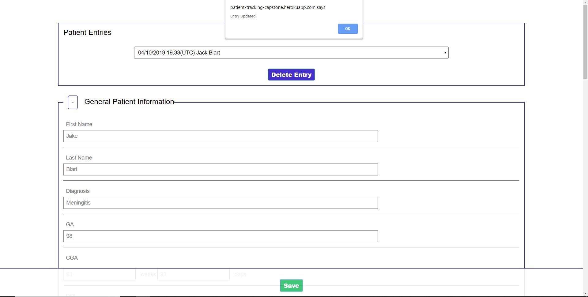
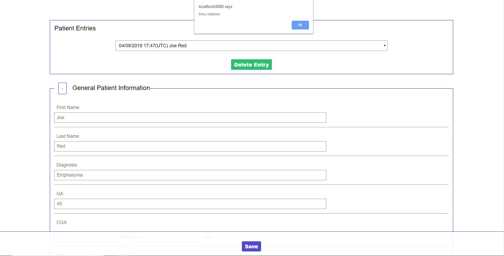
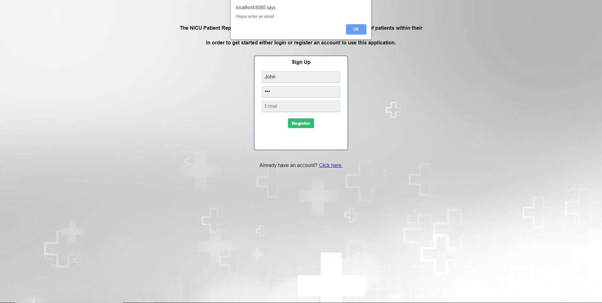
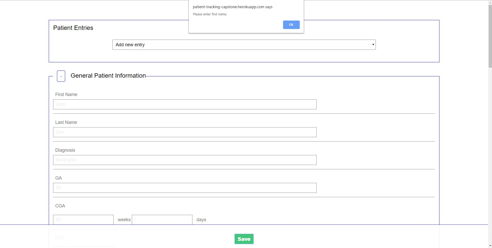

# NICU Patient Tracking Application
Live Preview with node @ https://patient-tracking-capstone.herokuapp.com/
Live Preview without Node https://pillgrumm.github.io/patient-tracking-node-capstone/public/index.html

This application is meant to be used for the medical staff of a neonatal intensive care unit. The staff will be able to keep record
of patient information simply by logging into their units (or personal) account to get a list of existing patient records, while
also being able to update existing records and add brand new ones.

I am not in the medical field myself but my father is; he pitched this as an idea and it was decided that this would be a very good project to practice building a full stack application.

## Screenshots
Landing Page/Login Page 

Registration Page 

Main Page(No Patient Selected) 

Main Page(Patient Selected) 

General Information Field 

Patient Added Alert 

Patient Updated Alert 

Patient Deleted Alert 

Login Error 

Register Error 

Required Field Error 

## User Stories
**Landing Page**

  As a user, I want to view the first page of the app and how to use it.

  As a user, I will also see a login form where I can input a prexisting account name and password.

  As a user, I will also be able to click on a button that takes me to the registration form.

  As a user, I will also be able to click the login button after inputting my account information taking me to the main form.

  **Registration Page**

  As a user, I will be able to see the required fields for registration.

  As a user, I will also be able to click on a button that takes me to the login form.

  As a user, I will also be able to click the regstier button after inputting my account information taking me to the main form.

  **Main Page**

  As a user, I will be able to see the upper container which holds prexisting patient names in a dropdown bar (if existing).

  As a user, I will be able to click/select a patient name, doing so I will see the every field populated based on the previous entries for that patient.

  As a user, I will also see a delete button when a patient name is selected.

  As a user, if I save the patient information, I will see all fields populate back to nothing, and the patient name and will be added to the dropdown bar and fields will be saved for that patient.

  As a user, if I save the patient currently selected, I will see all fields populate back to nothing, and the patient name (if changed) will be updated within the dropdown bar, as well as any modified fields.

  As a user, if I delete the patient currently selected, I will see all fields populate back to nothing, and the patient name will be removed from the dropdown bar.

## Technical

<h3>Technolgies used</h3>

#### Front End

* HTML5
* CSS3
* JavaScript
* jQuery

#### Back End

* Node.js
* Express.js
* MongoDB
* Mongoose
* mLab database
* Mocha and Chai for testing
<h3>Responsive</h3>
<ul>
  <li>The app is responsive and optimized for both desktop and mobile viewing and use.</li>
</ul>

## Development Road Map
Features for future iterations include:
- Add ability to save at any point during entering fields.
- Added security so the application can potentially be used in a real setting.
- Automatic logout after inactivity

## Node command lines
* npm install ==> install all node modules
    * npm install --save bcryptjs body-parser cors express mongodb mongoose passport passport-http unirest
    * npm install --save-dev chai chai-http mocha faker
* nodemon server.js ==> run node server
* npm test ==> run the tests
